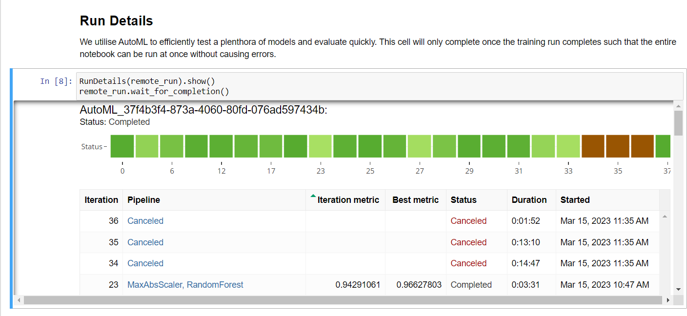
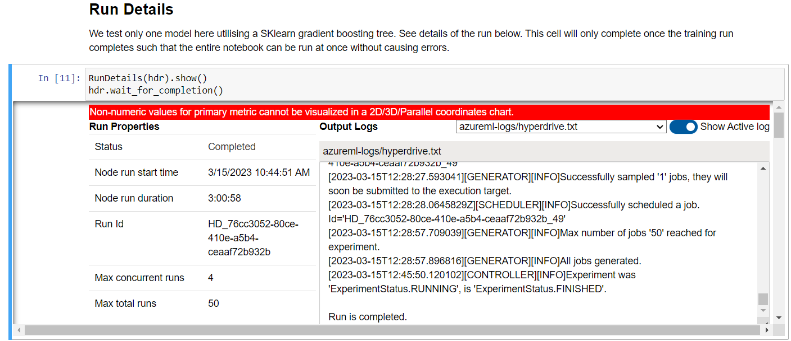
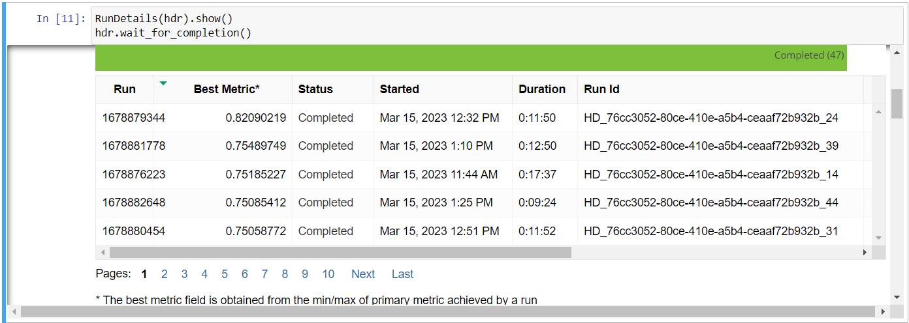

# Creating and deploying a model to predict Covid 19 survival for Udacity capstone project

This project is the implementation of the capstone project for the Udacity ML engineering course. 
For this, covid 19 data from Kaggle is loaded, transformed and used to build 2 models, one through a hyperparameter sweep and one AutoML model. The better of the 2 models is deployed as a webservice. A notebook for local deployment to test is found with the suffix _local_deploy.
## Project Set Up and Installation
In order to run the project, all azureml packages need to be installed and an access to kaggle is needed. The needed opendatasets package is automatically installed in the hyperparamtertuning.ipynb notebook which should be run first, the automl.ipynb after.

## Dataset

### Overview
The dataset consists of patient data during the initial phase of the covid 19 pandemic from the US.

### Task
The target of the project is to predict the survival of the given patients.   The dataset is fortunately very unbalanced, however as the goal was to focus on tracking and deployment, no balancing efforts have been made.

### Access
The data is downloaded automatically from kaggle in the code utilising the opendatasets python package. For that a kaggle key and token is needed.

## Automated ML
The autoML loads the dataset registered in the Hyperparameter tuning model (run that first) and then runs a 3 fold cross validation autoML classification. Due to the imbalance in the data weighted area under curve was chosen as the metric to optimise.

### Results
The best model was a Voting Ensemble and reached an AUC-weighted metric of 0.966 and an accuracy of 95.0% using:

## Hyperparameter Tuning
For the hyperparameter tuning part, a gradient boosting tree classifier was selected. It was steered through a training script and optimised along 3 variables: the number of estimators, the learning rate and the subsampling rate.

### Results
The best model reached an AUC_weighted of 0.753 and an accuracy of 94.8%. This was achieved using a learning rate of 0.9950538418256376 , 50 estimators and a subsampling rate of 1.0 .

## Model Deployment
There are 2 different deployments for the hyperparameter tuned model, one as a local webservice to test and one as an ACI based endpoint with key authentication. The inference is steered through the covdata_entry.py entry script. To deploy another model only the model name in the code and the endpoint name need to be adapted.

### Querying the endpoint
The output can be queried through a simple post request. See an example of the input and request below:

Here for security reasons the URL and key are in a variable. It is easy just to replace both with thecorresponding string to allow general access.

## Screen Recording
https://youtu.be/8BgSiJ9rUHA

## Future improvements
Both models could profit from improved feature engineering as no effort was made here apart from transforming categorical variables to dummy columns.

### Automated ML
The Automated ML model did not allow for neural networks which could lead to better performance. Similarly early stopping restrictions could be loosened.

### Hyperdrive Run
The trained model should employ the same cross validation as the Automated ML model to allow for better comparability. Feature scaling should be added as well as a wider search grid and more hyperparameters. Further other models can be tested based on the findings from the Auto ML run.

## Standout Suggestions
The models that are registered are both ONNX enabled to make them deployeable on all platforms.
Logging is enabled for the deployed webservices to allow for root cause analysis in case of failure.
